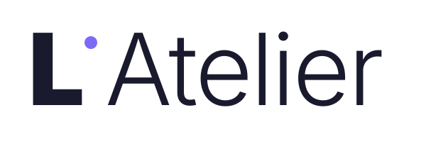

<p align="center">
  <picture>
    <source media="(prefers-color-scheme: dark)" srcset="src/assets/atelier-wordmark-light.svg">
    
  </picture>
</p>

# L'Atelier

A desktop MongoDB client — connect to a server, browse databases and collections, and query and edit documents. Electron + Vite + React; all persistence and Mongo I/O lives in the main process behind a typed IPC bridge.

See `specs/` for the full design (foundation + connections + workspace + aggregation).

## Quickstart

Requires **Node.js 24.15 or newer**, and below 25 (see `.nvmrc`). The 24.15 floor
is not arbitrary — `jsdom`, which the component tests run in, declares
`^22.22.2 || ^24.15.0 || >=26.0.0`, so an older 24.x fails `npm install` under
`--engine-strict`.

```bash
npm install        # better-sqlite3 ships an N-API prebuilt — nothing compiles
npm run dev        # start Vite + Electron in watch mode
```

## Commands

| Command                       | Purpose |
| ----------------------------- | ------- |
| `npm test`                    | Vitest unit + integration + component (runs under system Node) |
| `npm run test:unit`           | Unit tests only |
| `npm run test:integration`    | Integration tests (includes a real `mongodb-memory-server`) |
| `npm run test:e2e`            | Playwright E2E against a built Electron app |
| `npm run dev` / `electron:dev`| Start Vite + Electron in watch mode |
| `npm run build`               | Full production build |
| `npm run lint`                | ESLint |
| `npm run audit:ipc`           | Verify only allow-listed channels accept plaintext secrets |

## A note on native modules (`better-sqlite3`)

Nothing to do — but it's worth knowing why, because this used to be the single most common way to lose an afternoon here.

`better-sqlite3` 13 is an **N-API** addon. It ships prebuilt binaries keyed by platform and architecture only (`prebuilds/darwin-arm64.node`), with no Node ABI in the name, so the same binary works under system Node and under Electron. `npm install` compiles nothing, and `npm test`, `npm run test:e2e`, `npm run electron:dev`, and a packaged build all run off one install.

Before v13 the addon was compiled against one ABI at a time, and you had to rebuild between running Vitest and launching Electron. Those `rebuild:node` / `rebuild:electron` scripts are gone.

If you ever see

```
The module '…/better_sqlite3.node' was compiled against a different Node.js version
using NODE_MODULE_VERSION XXX. This version of Node.js requires NODE_MODULE_VERSION YYY.
```

do **not** reintroduce a rebuild script. It means something added a compile-from-source path — a native dependency that isn't N-API, or a `--build-from-source` flag. Fix that instead.

## Repo layout

```
electron/       main-process code (DB, Mongo, secrets, IPC router)
  db/           SQLite + migrations + repositories
  secrets/      SecretsVault on Electron safeStorage
  mongo/        MongoPool, URI builder, error classifier, EJSON helpers
  ipc/          envelope, router, validators
shared/         TypeScript types shared across main + renderer (runtime-free)
src/            renderer (React)
tests/
  unit/         pure-logic unit tests
  integration/  main-process services against real SQLite + memory Mongo
  component/    renderer components against a mocked window.atelier
  e2e/          Playwright + Electron
specs/          design docs; iteration 1
scripts/        build tooling (audit-ipc)
```

## Contributing

Read [`CONTRIBUTING.md`](./CONTRIBUTING.md) before writing anything. Two things
decide most of it: `specs/` is the design source of truth, and the
**Definition of done** is a fixed set of gates every change owes — including
mutation testing and E2E, neither of which is optional.

Open an issue first for anything past a typo or an obvious one-line fix.

Participation is governed by the [Code of Conduct](./CODE_OF_CONDUCT.md).

Release history is in [`CHANGELOG.md`](./CHANGELOG.md).

## Security

To report a vulnerability, see [`SECURITY.md`](./SECURITY.md) — use GitHub's private
advisory flow rather than opening a public issue.

## Licence

[MIT](./LICENSE) © Anonhym

L'Atelier is an independent project. It is **not affiliated with, endorsed by, or
sponsored by MongoDB, Inc.** "MongoDB" is a trademark of MongoDB, Inc., used here only
to describe what this client connects to.
